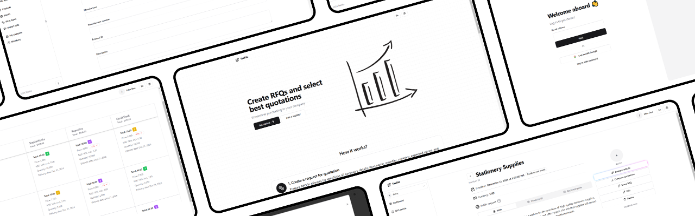

  

  <h1 align="center">Teklifo</h1>

  

    Let's bridge the gap between clients and suppliers
     
     
    <a href="https://teklifo.com" target="_blank">Web-site</a>
    ·
    <a href="https://github.com/teklifo/teklifo/issues/new" target="_blank">Request feature</a>
  

## About The Project

With Teklifo, you can streamline your procurement process: publish RFQs, collect, and analyze quotations in a simple and user-friendly format. This reduces the workload on your procurement department, freeing it from routine tasks.

## Features

**RFQ**

Publish RFQ for the products you need, specifying quantities, preferred prices, and desired delivery dates.

**Quotations**

Send quotations to clients in response to their RFQs.

**Comparison**

Compare received quotations across individual product items using a wide range of criteria.

**✨ AI-Powered Proposal Analysis**

Leverage an LLM model for quick and efficient analysis of received quotations.

**Reference Information**

Add reference data to the system for more convenient operations, including product catalogs, pricing, and inventory levels.

**Team Collaboration**

Create a profile for your company and invite team members to collaborate effectively.

## Technology Stack

The project architecture is a monolith built on Next.js, using the following technologies:

- TypeScript
- React
- Next.js
- Node.js runtime
- PostgreSQL
- Prisma ORM
- shadcn/ui
- Tailwind CSS
- BullMQ & Redis
