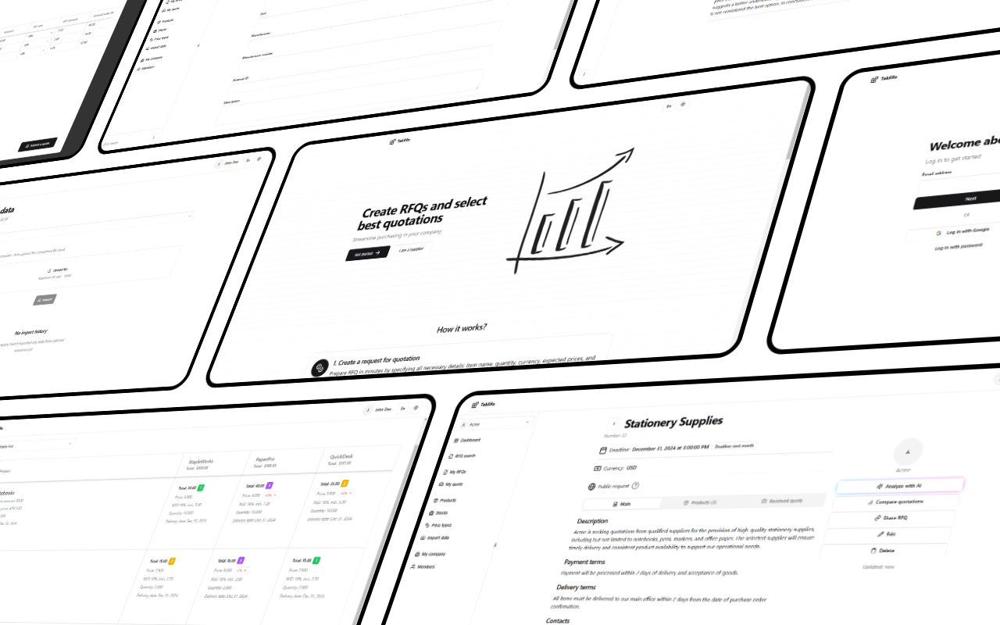

  

  <h1 align="center">Teklifo</h1>

  

    Помогаем покупателям и поставщикам найти друг друга
     
     
    <a href="https://infostart.ru/1c/articles/2241692/" target="_blank">Infostart</a>
    ·
    <a href="https://teklifo.com" target="_blank">Веб-сайт</a>
    ·
    <a href="https://github.com/teklifo/teklifo/issues/new" target="_blank">Запросить функционал</a>
  

## О проекте

С помощью Teklifo вы можете оптимизировать процесс закупок в вашем предприятии: публикуйте запросы цен, собирайте и анализируйте коммерческие предложения в простом и понятном формате. Это позволит вам сократить нагрузку на отдел закупок и освободить его от рутинных задач.

## Возможности

**Запросы цен**

Публикуйте запросы цен на товары, по которым вы хотите собрать коммерческие предложения, указав их количество, предпочитаемые цены, а также требуемую дату доставки.

**Коммерческие предложения**

Отправляйте коммерческие предложения клиентам в ответ на их запросы.

**Сравнение предложений**

Сравните полученные предложения в разрезе каждой из товарных позиций по целому ряду критериев.

**✨ Анализ предложений от ИИ**

Используйте LLM модель для быстрого анализа полученных предложений.

**Справочная информация**

Внесите в систему справочную информацию для более удобной работы: список номенклатуры, цены, остатки на складах.

**Работа в команде**

Создайте профиль вашей организации. Приглашайте новых участников и работайте в команде.

**Интеграция с 1С**

Работайте с сервисом напрямую из 1С с помощью специального [расширения конфигурации](https://github.com/teklifo/teklifo-1c).

## Стек технологий

Архитектура проекта представляет собой монолит на Next.js. Используются следующие технологии:

- TypeScript
- React
- Next.js
- Node.js runtime
- PostgreSQL
- Prisma ORM
- shadcn/ui
- Tailwind CSS
- BullMQ & Redis
